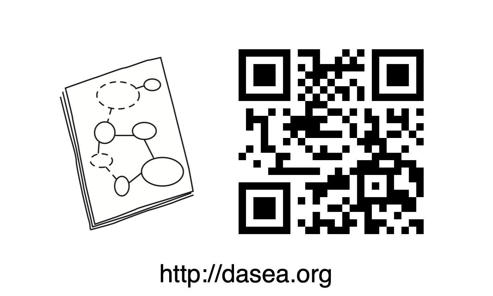
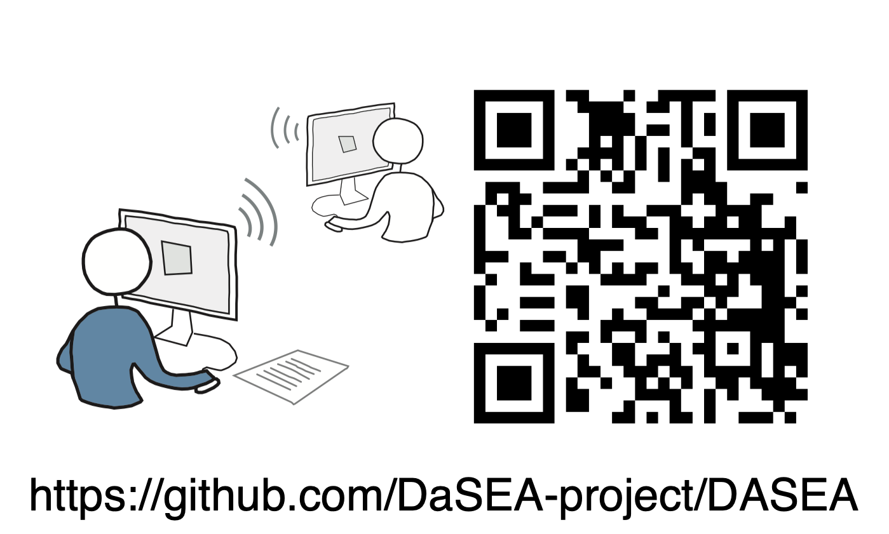

  

# Presentation of the DaSEA Dataset @ MSR 2022

## What is this?

This repository contains a presentation of the DaSEA dataset and the corresponding paper _"DaSEA – A Dataset for Software Ecosystem Analysis"_, which was presented at the [_Data and Tool Showcase Track_](https://conf.researchr.org/track/msr-2022/msr-2022-technical-papers?track=MSR%20Data%20and%20Tool%20Showcase%20Track#) at the [2022 Mining Software Repositories Conference (MSR)](https://conf.researchr.org/home/msr-2022).

## Running the presentation

  * Click this button 👉  to walk through the executable presentation.

## What else?

<table>
  <tr>
    <th>
      <a href="http://dasea.org">
        

          <h2>Get the dataset</h2>
        

      </a>
    </th>
    <th>
      <a href="https://github.com/DaSEA-project/DASEA">
        

          <h2>Contribute</h2>
        

      </a>
    </th>
    <th>
      <a href="https://itu.dk/~ropf/blog/assets/msr2022.pdf">
        

          <h2>Read the paper</h2>
        

      </a>
    </th>
  </tr>    
  <tr>
    <th>
      <a href="http://dasea.org">
        

          
        

      </a>
    </th>
    <th>
      
    </th>
    <th>
      
    </th>      
  </tr>
</table> 